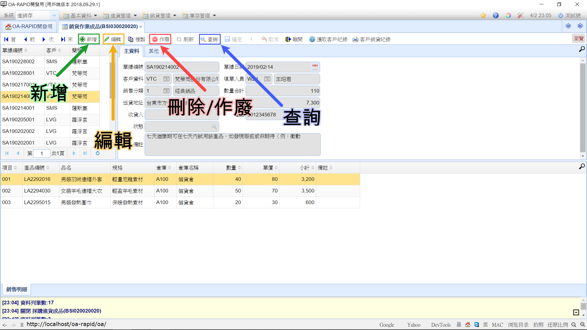

## 資料維護

下方這張**"維護功能意示圖"**，分別標示三項維護功能:

###### 維護功能意示圖▲

----

### 新增紀錄

新增紀錄的步驟:

1. 首先點擊工具列中的 "新增" 按鈕
2. 到表單欄位填寫新的表單資料
3. 完成填寫後再點擊 "確定" 按鈕

----

### 編輯紀錄

編輯紀錄的步驟:

1. 首先點擊工具列中的 "編輯" 按鈕
2. 到表單欄位修改表單資料
3. 編輯完成後再點擊"確定"按鈕

----

### 刪除/作廢紀錄

刪除/作廢紀錄的步驟:

1. 點擊工具列中的 "刪除" 按鈕
2. 這時會彈跳出是否確定刪除的對話框
3. 確認要刪除後再點擊 "確定" 按鈕

### 查詢紀錄

刪除/作廢紀錄的步驟:

1. 點擊工具列中的 "查詢" 按鈕
2. 在欄位填寫查詢條件，
3. 確認要刪除後再點擊 "確定" 按鈕

  > **查詢技巧:**
  >
  > 開頭查詢 - 將符號 "%" 填在查詢關鍵字的前方 (範例: SA%)。
  >
  > 句尾查詢 - 將符號 "%" 填在查詢關鍵字的後方 (範例: %001)。