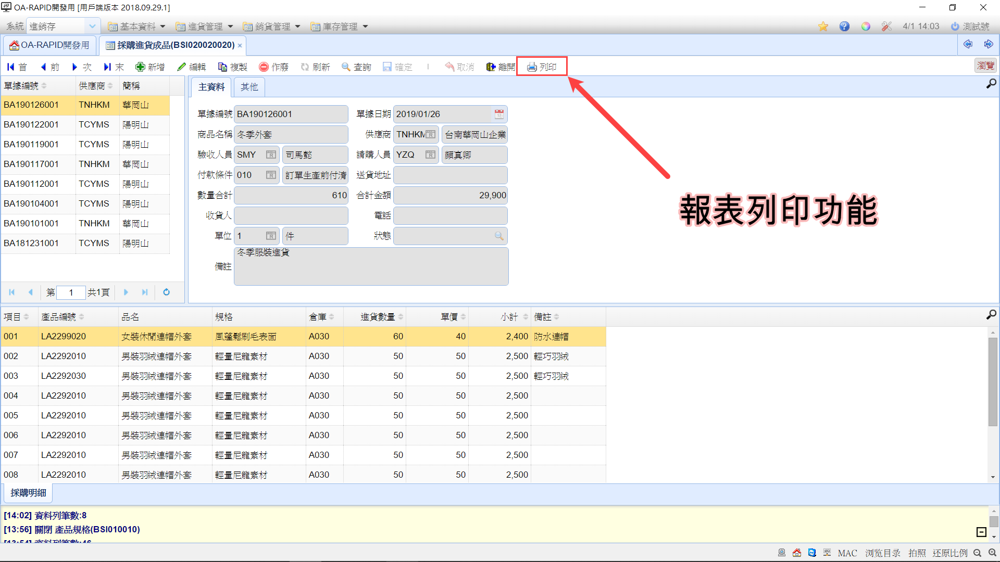

## 報表操作

工具列中位於離開功能右方的 **"額外功能"** 會看到列印功能。

報表列印有兩種:

一、打印報表，點擊 "列印" 功能後直接列印報表。

###### 列印功能意示圖▲

----

二、統計報表，先查詢條件後才會列印報表。

###### 查詢意示圖▲

----

###### 預覽意示圖▲

報表查詢列印步驟:

1. 點擊 "列印" 功能後會開啟報表查詢。
2. 填寫查詢條件、選擇報表樣板，後再點擊 "查詢" 取得資料。
3. 最後點擊 "預覽" 查看報表，並點擊左上的 "列印報表" 輸出報表。

