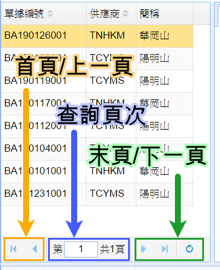

## 表單介面

表單介面大致區分為三至四個操作區域。

常見的表單介面佈局有以下兩種:

一、在 **"表單畫面意示圖 (1)"** 中的 "明細區域" 是位於表單畫面的下方。

###### 表單畫面意示圖 (1)▲

----

二、在 **"表單畫面意示圖 (2)"** 中的 "明細區域" 則是位於 "主資料標籤" 內。

###### 表單畫面意示圖 (2)▲

----

### 工具列

工具列在表單的最上方，裡面包含操作表單時需要的重要功能項目。

在工具列中，從左到右依序的所有功能分別是:

* **切換紀錄** - 切換上一筆/下一筆/首筆/末筆的資料。
* **新增紀錄** - 新增一筆紀錄。
* **編輯紀錄** - 編輯目前這一筆紀錄。
* **刪除/作廢紀錄** - 刪除或作廢目前這一筆紀錄。
* **刷新紀錄** - 刷新表單資料。
* **查詢紀錄** - 查詢表單資料。
* **確定編輯** - 確定各項操作的異動。
* **取消編輯** - 取消正在新增/修改的動作。
* **離開表單** - 關閉目前使用的功能。
* **額外功能** - 位於離開功能右方，依每個表單的需求增加的額外功能。

----

### 資料視圖

位於畫面左側/上方，這裡會顯示每一筆的表單項目。

###### 資料視圖意示圖▲

資料視圖下方的切換視圖頁次:

* 首頁/上一頁
* 查詢頁次。
* 末頁/下一頁。

----

### 主資料

主資料在表單中的最大區域，在這瀏覽與編輯表單的主資料。

* **主資料標籤列** - 切換顯示資料的標籤，請確定標籤是選擇 "主資料" 才會顯示表單的主資料。
* **明細資料** - 包含填寫表單明細資料的欄位。

----

### 明細

明細在表單的下方或 "主資料標籤列" 內，在這瀏覽與編輯表單的明細資料。

* **明細標籤列** - 切換顯示資料的標籤。

* **明細資料** - 包含填寫表單明細資料的欄位。

----

### 欄位種類:

* **一般輸入** - 可以填寫與修改的普通欄位。
* **不可輸入** - 不可填寫的欄位。
* **參考查詢** - 點擊欄位右方的R字按鈕開啟參考查詢。
* **參考顯示** - 欄位會顯示編號的參考名稱。