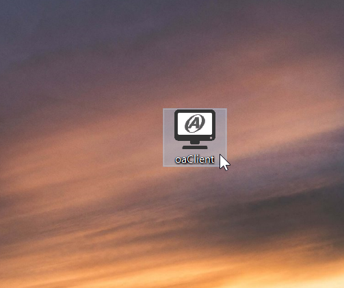

# 用戶登入

#### 一 . 開啟桌面上的 oaClient.exe

###### oaClient.exe 意示圖▲

#### 二 . 點擊右上的[未登入]或左邊[黃色鎖頭]按鈕，開啟登入視窗

- 輸入用戶編號、密碼、驗證碼
- 點擊 "登入" 按鈕

> *提醒: 變更驗證碼 - 點擊 "驗證碼圖示" 可以切換當前的驗證碼。
>             錯誤訊息 - 畫面最下方的訊息框會顯示操作過程的錯誤資訊。

